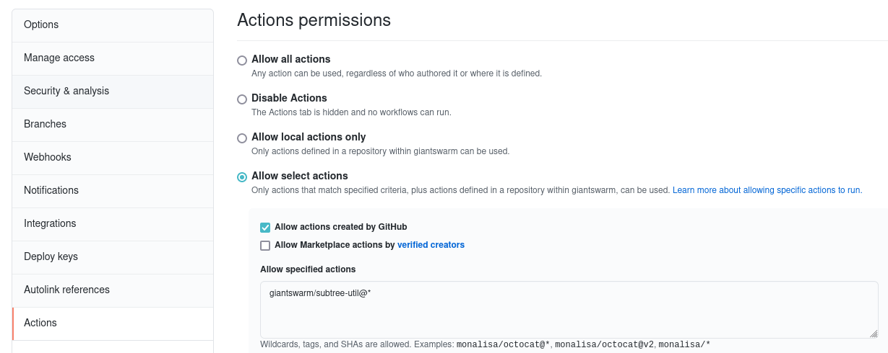

# subtree-util

Helpers to make setting up an app repository which follows an upstream.

## GitHub Action workflow

It is possible to automate some parts of the workflow using a GitHub actions workflow.

The workflow definition goes into the fork of the upstream you want to sync with.
A workflow secret containing a GitHub access token is **required**.

Additionaly, you may want to configure your repository to only allow the `giantswarm/subtree-util` action.

<details>

<summary>Configuration screenshot</summary>



</details>

### Example `.github/workflows/sync-form-upstream.yaml`:

```
name: Sync from upstream

on:
  # schedule:
  #   - cron: '*/5 7-20 * * *'

  # Allows to run this workflow manually from the Actions tab
  workflow_dispatch:

jobs:
  sync-app-repository:
    runs-on: ubuntu-latest
    steps:
      - name: Checkout
        uses: actions/checkout@v2

      - name: Sync from upstream
        uses: giantswarm/subtree-util@main
        with:
          target_github_token: ${{ secrets.ARCHITECT_BOT_GITHUB_REPO_SYNC_TOKEN }}
          target_repository: <TARGET-REPOSITORY>
          target_path: <TARGET-PATH>
          source_tag_wildcard: <SOURCE-TAG-WILDCARD>
          source_path: <SOURCE-PATH>
```

### `target_repository`

Which repository should be updated. `org/repository-name`

### `target_path`

The path in the target repository where the subtree should be applied.

### `source_tag_wildcard`

Update the fork only to the latest tag which matches the wildcard. Examples are `v*` or `kong-*`

### `source_path`

The path in the fork where to take the subtree from.

### `target_github_token`

A valid GitHub access token with permissions on the target repository.

## Manual usage

Apart from the automation, there are some scripts that help with doing synchronization the manual way.

### Requirements

- git >= 2.27.0
- jq >= 1.5
- curl
- gh >= 1.9.2


### Initial setup

- Prepare some required values
  - A GitHub personal access token
  - The org/repository-name of the upstream repository
  - The directory path in the upstream repository you want to track
  - The target repository-name

TODO...

### API Links

- [Create a fork](https://docs.github.com/en/rest/reference/repos#create-a-fork)
- [Rename a repository](https://docs.github.com/en/rest/reference/repos#update-a-repository)
- [Create a repository from template](https://docs.github.com/en/rest/reference/repos#create-a-repository-using-a-template)


## Zum mitschreiben

1. Forkt upstream repository (manuell)
2. Eigenes app repository erstellen (manuell)
3. Noch nicht im Repo hier: subtree aufsetzen,
    1. `clone-fork.sh` verwenden um den fork zu clonen +  remote aufzusetzen
    2. `clone-app.sh` verwenden um das app repo zu clonen
    3. ??? subtree aufgesetzt
4. Eigenen Fork updaten: `update-fork.sh`
    1.  
